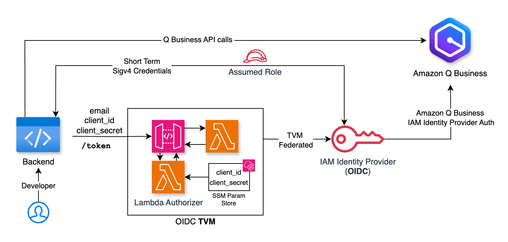
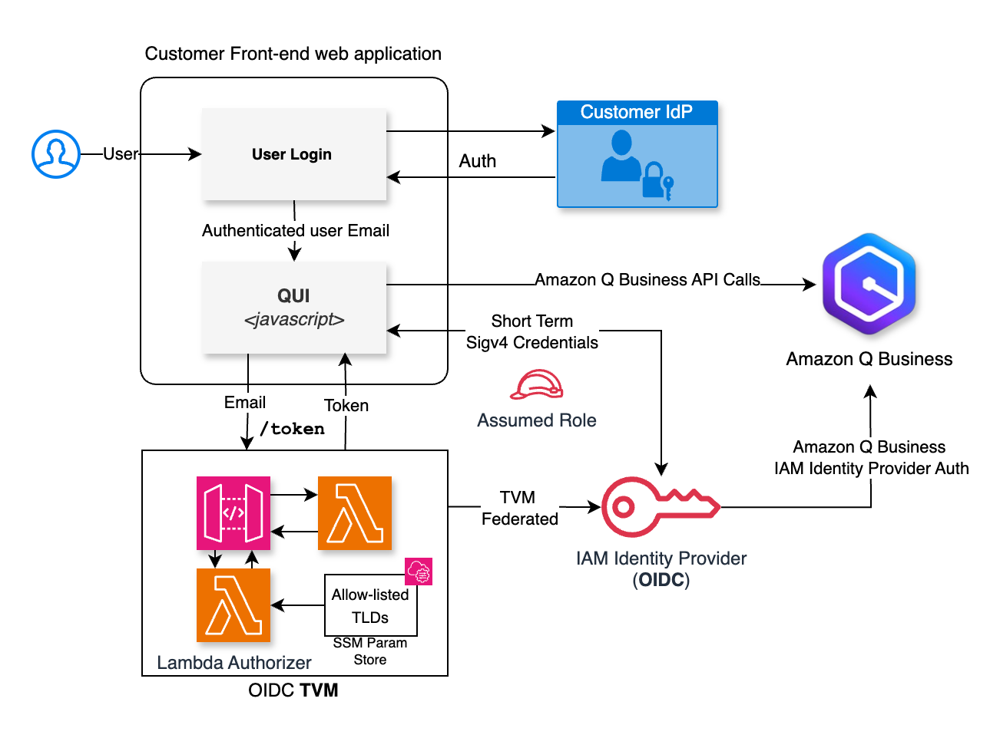

# Amazon Q Business Token Vending Machine and QUI

> **Pre-requisite**
> This solution requires using Amazon Q Business with IAM Identity Provider and is not compatible with IAM Identity Center (IDC) based auth setup. For calling Amazon Q Business APIs while using IDC, check [this GitHub repository](https://github.com/aws-samples/custom-web-experience-with-amazon-q-business).


Deploy a fully customizable Amazon Q Business AI Assistant experience. This solution includes:

## 1. TVM - Token Vending Machine

TVM is a handshake mechanism between an enterprise authenticated app and Amazon Q Business through a secure **token vending machine (TVM)**. The TVM is implemented using a single AWS Lambda function and API gateway using OIDC Specifications and can federate with IAM Identity Provider which is used with Amazon Q Business as authentication mechanism. The TVM can accept an email address of any authenticated user and issue an OIDC Token which is used to generate SigV4 credentials in order to assume an identity-aware role for Amazon Q Business. This credential can then be used to call Amazon Q Business APIs. 

The TVM, which acts as an OIDC provider, comes with it’s own issuer url, `/.well-known/openid-configuration`  as well as `/.well-known/jwks.json` endpoints which are OIDC compliant. TVM OIDC provider uses a Public-Private key pair which is encrypted and stored with AWS SSM Parameter store. The TVM also comes with a `/token` endpoint responsible for issuing OIDC Identity Tokens using the private key. IAM Identity Provider makes use of the `/.well-known/*` endpoints and the public key to ensure the validity of the OIDC tokens issued by the `/token` endpoint and has permissions to Amazon Q Business API’s via an IAM Role and Trust relationships. In essence, when provided with a valid email address, the token issued by `/token` endpoint will be identity aware and can be used to assume the said IAM Role to generate identity aware SigV4 credentials for Amazon Q Business API calls.



## 2. QUI - Amazon Q AI Assistant Web Component

In order to build a fully personalized user experience a web component (QUI, currently built with react) is provided. QUI works with TVM to make direct calls to Q Business APIs using short-term (usually 15 mins) SigV4 credentials using tokens issued by the TVM, using Amazon Q Business JavaScript SDK. You can use QUI from within your authenticated UX to natively embed (non-iframe) Q Business AI Assistant functionality.

Currently, QUI requires TVM to be deployed and is the only mechanism that the custom web UI works with. TVM on the other hand, can not only be used for QUI, but can be used to build your own applications using Amazon Q Business APIs via simple auth mechanism.



### Deploy TVM (Token Vending Machine) for Amazon Q Business

1. Clone this repo and `cd` into `/amzn-q-auth-tvm` directory
2. Run `npm install --save` and create a `.env` file.
3. Enter the following in the `.env` file with the account details of where you want to deploy the stack

```
CDK_DEFAULT_ACCOUNT=<account_id>
CDK_DEFAULT_REGION=<region>
```

4. `cdk bootstrap`
5. `cdk synth`
6. `cdk deploy --require-approval never --outputs-file ./cdk-outputs.json --profile <profile>`
7. Once the stack is deployed note the following values from the stack's output

```
Outputs:
MyOidcIssuerStack.AudienceOutput = xxxxxxx
MyOidcIssuerStack.IssuerUrlOutput = https://xxxxxxx.execute-api.<region>.amazonaws.com/prod/
MyOidcIssuerStack.QBizAssumeRoleARN = arn:aws:iam::XXXXXXXX:role/q-biz-custom-oidc-assume-role

✨  Total time: 64.31s
```

8. The stack will create the TVM (Audience and Issuer endpoints), an IAM Role to assume with Q Business permissions, an IAM Identity Provider already setup with the Issuer and Audience (You should be able to see this Identity Provider from IAM Console)
9. Setup a Q Business App, Select "AWS IAM Identity Provider" (**Note**: Uncheck "Web Experience" from "Outcome" when creating the Q Business App), select "OpenID Connect (OIDC)" provider type for authentication and select the above created Identity Provider from the drop down, in "Client ID" enter the Audience value from the stack output above `AudienceOutput` (also found in `cdk-outputs.json` file that captures the output of stack deployment, or in your Cloudformation stack deployment output).
10. Setup your Q Business App following the rest of the steps by adding data sources etc.

### Delete the TVM stack

To delete the TVM stack-

1. Change into the TVM stack root directory

```bash
cd amzn-q-auth-tvm
```

2. Run

```bash
cdk destroy
```

### Deploy sample React App with Custom Amazon Q UI usage

1. Change directory to `amzn-q-custom-ui`.
2. Run `npm install --save` to install dependencies.
3. Create a `.env` file at the root of the directory with these values. 
4. Note: the email should ideally be acquired by your user authentication mechanism.

```
VITE_QBIZ_APP_ID=<q-biz-app-id>
VITE_IAM_ROLE_ARN=<iam-role-arn-from-stack-deployment>
VITE_EMAIL=<email address>
VITE_AWS_REGION=<region-where-q-biz-app>
VITE_ISSUER=<issuer-url-from-stack>
```

> NOTE: For production you will need a similar file called `.env.production`

4. Run `npm run dev`
5. Visit your app in `localhost` URL provided by Vite local server

